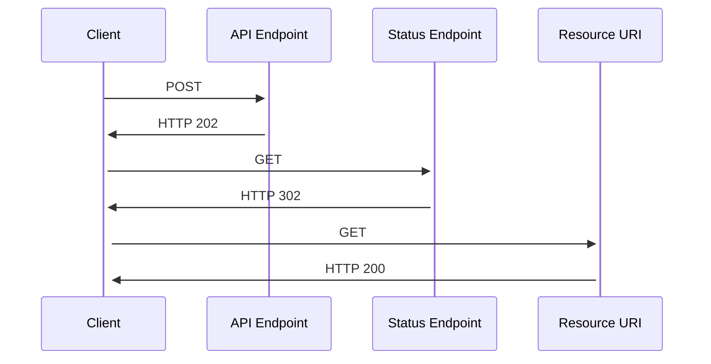

# Integration Patterns

**SHOULD** use standard API integration patterns.

## Anti-corruption layer

**SHOULD** wrap legacy APIs in an anti-corruption layer (ACL) so that consumers are able to use modern REST-based API semantics.

### Examples

Translate `SOAP` calls to `REST` calls.

- The ACL makes SOAP requests to the legacy API and exposes a RESTful endpoint for the new system.
- The ACL takes the XML data from the SOAP response and transforms it into a JSON format that the modern system expects.
- The ACL can map legacy API operations to RESTful principles (resources and HTTP methods).

## Asynchronous Request-Reply

**SHOULD** use the asynchronous request-reply API pattern for long running tasks, such as processing large datasets, image or video processing, or complex calculations.

- **Callback Pattern**: Use when the client provides an API to receive notifications.
- **Polling Pattern**: Use when the client does not provide an API to receive notifications.

### Examples

```text
POST /namespace/product/v1/tasks/123/start
Response: 202 Accepted

{
  "task_id": "123",
  "status": "in_progress"
}
```

Poll for status:

```text
GET /namespace/product/v1/tasks/123/status
Response: 200 OK

{
  "status": "completed",
  "result": "success"
}
```

Typical polling flow



## Bulk

**SHOULD** use bulk integration patterns to manage the processing of large volumes of data or multiple transactions in a single operation. This approach enhances efficiency and reduces the overhead associated with processing individual requests.

### Examples

- **Batch Processing APIs:** Endpoints that accept multiple records in a single request for insertion, update, or deletion.
- **Bulk Data Import/Export:** Tools and APIs that allow the import or export of datasets in formats like CSV, JSON, or XML.
- **Parallel Processing:** Distributing tasks across multiple processors or machines to handle large-scale data operations concurrently.

### Best Practices

- **Validate Data Thoroughly:** Ensure all records meet validation rules before processing to avoid partial failures.
- **Provide Detailed Feedback:** After processing, return information about successes and failures for individual records.
- **Optimize Performance:** Utilize efficient data structures and algorithms to handle large datasets without significant delays.
- **Manage Resource Utilization:** Monitor and limit resource usage to prevent system overloads during bulk operations.
