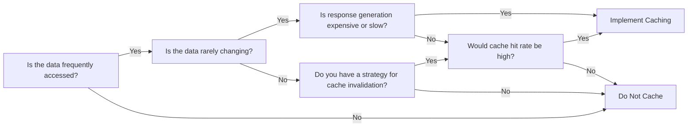
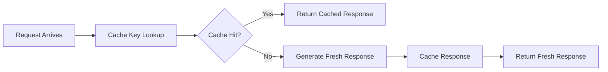
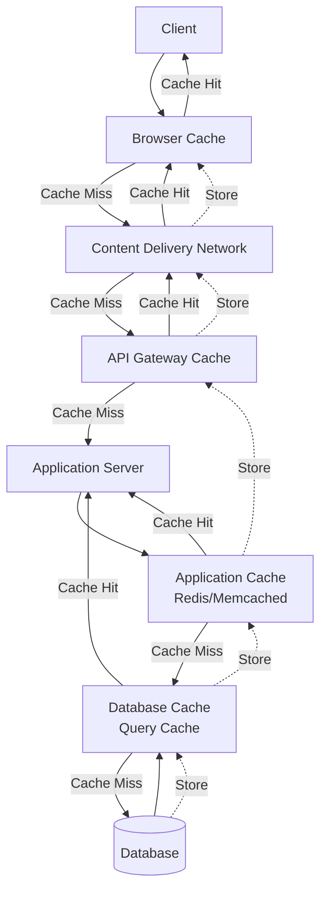
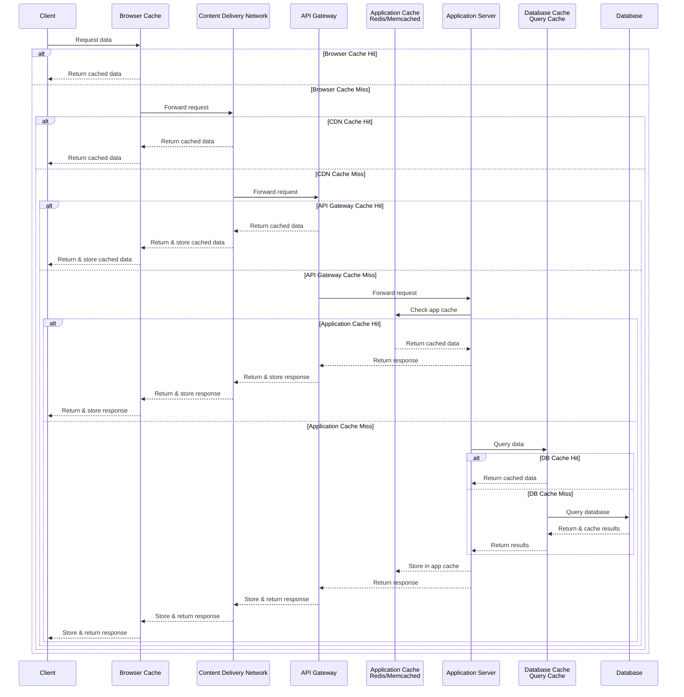
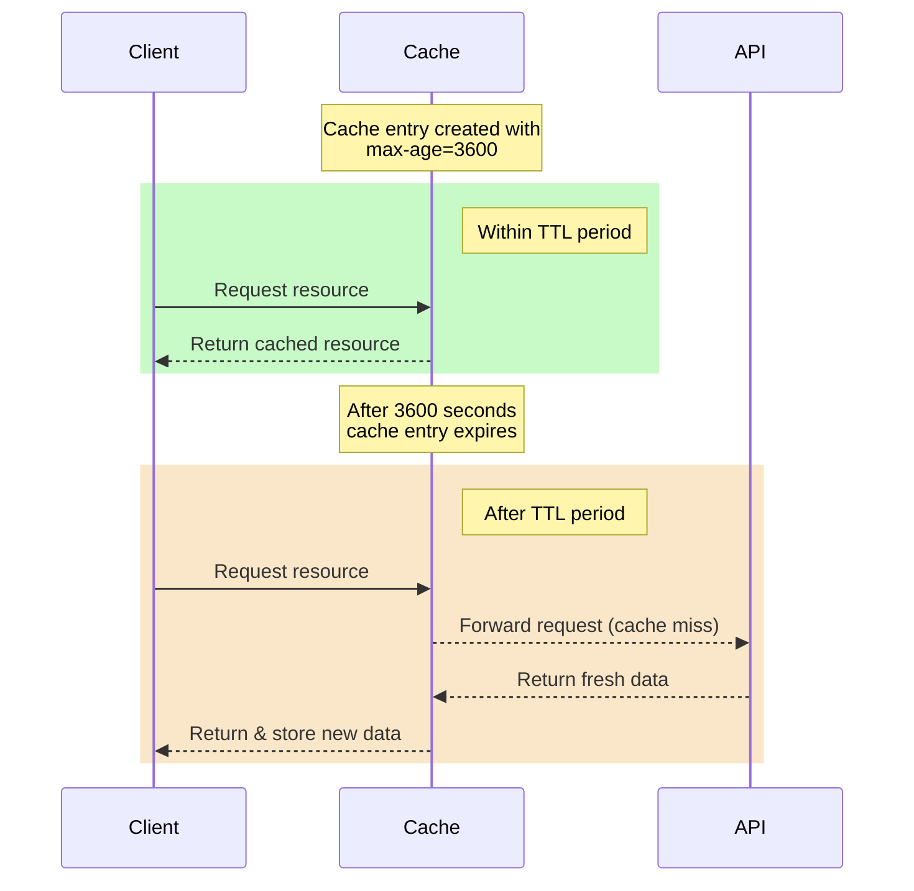
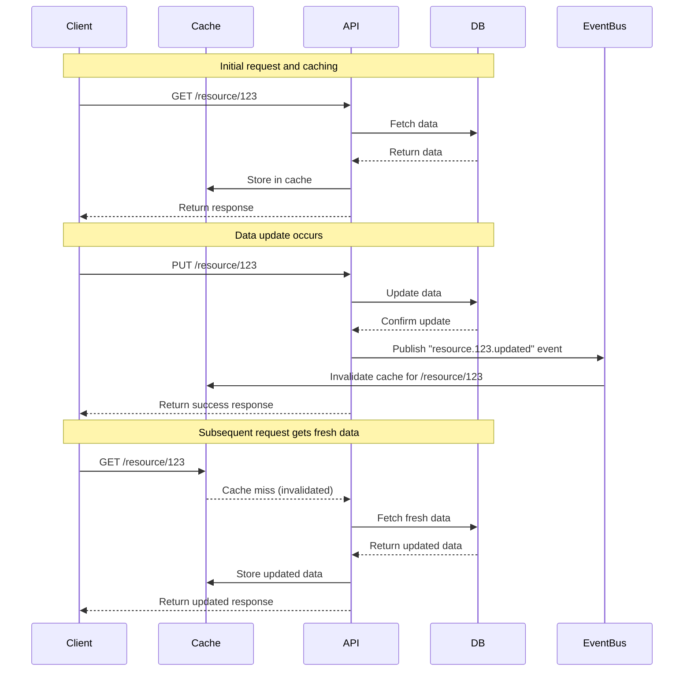
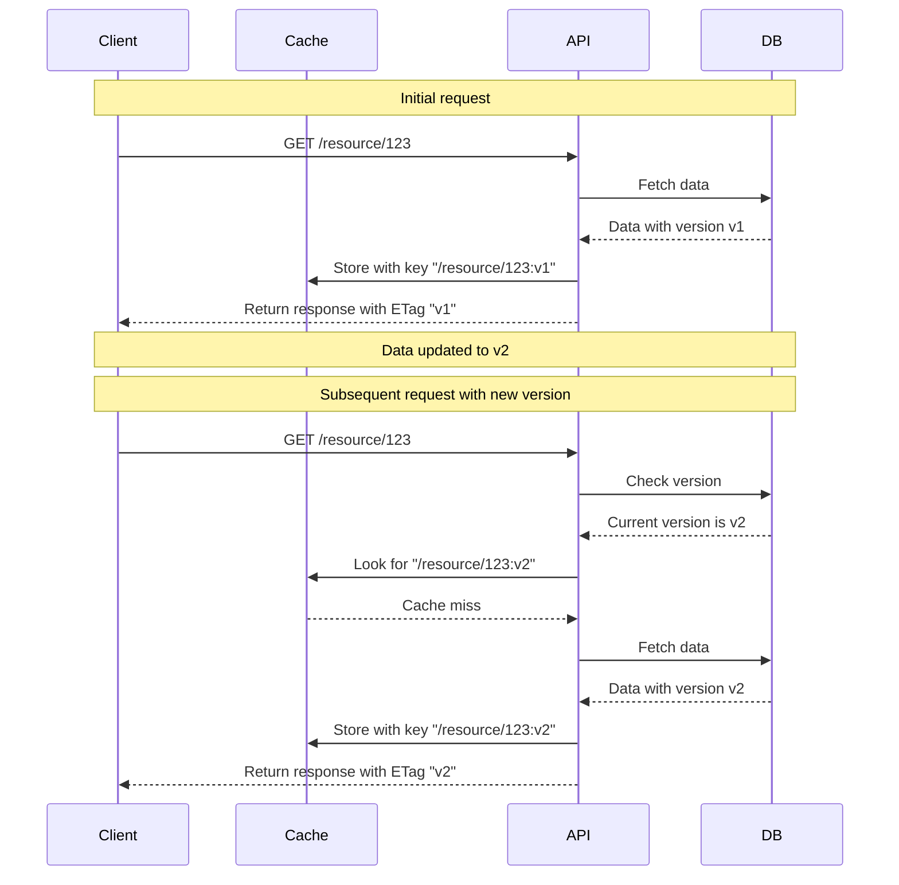
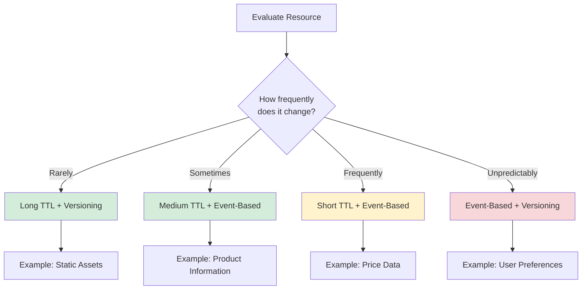
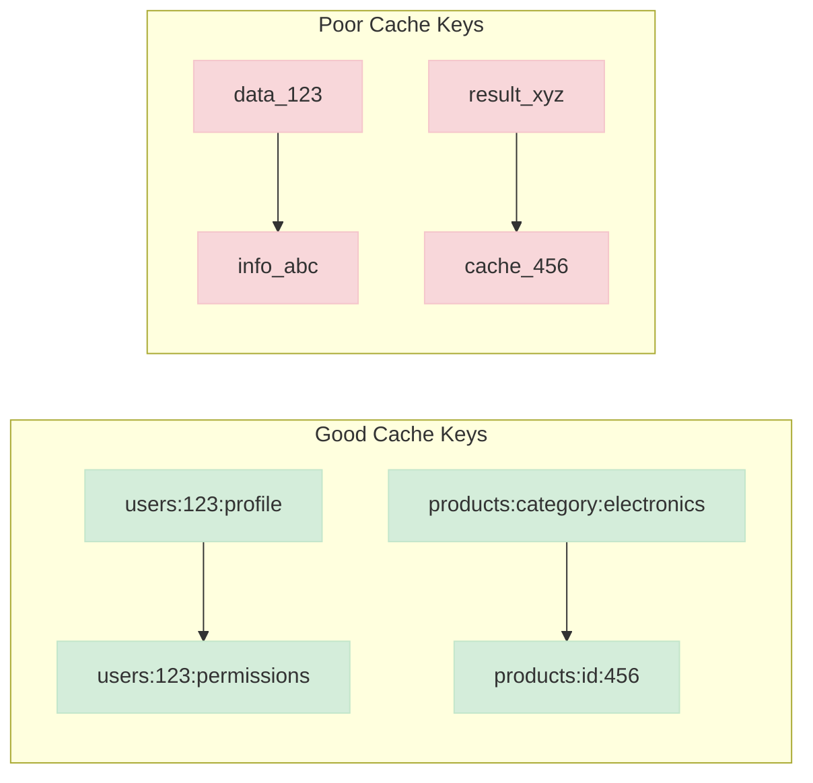

# Caching

## Overview

Caching plays a crucial role in API performance, reducing latency and server load while improving response times.

APIs **SHOULD** leverage appropriate caching mechanisms.

APIs **SHOULD** use a [multi-layered caching strategy](#multi-layered-caching-strategy) i.e. implement caching at various layers (e.g., API Gateway / CDN, application layer, database/persistence layer) to optimise performance.

APIs **SHOULD** use distributed caching

## Rule of Thumb

APIs **SHOULD** implement caching when:

- Serving frequently accessed, rarely changing data.
- Response generation is computationally expensive.
- Response times are slow or Requests are timing out.
- Handling high volumes of traffic.
- Serving static reference data or lookup tables.

APIs **SHOULD NOT** implement caching when:

- Serving volatile data that chances frequently, *unless* you have a strategy for [cache invalidation](#cache-invalidation-strategies).

Use the following flowchart to help you decide:



## Server-Side vs Client-Side Caching

APIs **SHOULD** implement server-side response caching and **SHOULD** avoid implementing client-side caching except where there are specific requirements that necessitate it. This approach provides greater control, security, and consistency.

The HTTP caching specification [RFC9111](https://datatracker.ietf.org/doc/html/rfc9111) is complex and often inconsistently implemented by clients, RESTful APIs frequently have nuanced caching requirements which may include handling data with mixed sensitivity levels that require careful cache management which generic client implementations might not handle correctly, furthermore client-side caching can lead to sensitive data being stored in *uncontrolled* environments.

Server-side caching reduces the risk of cached data leakage across different client contexts, ensures that caching policies are correctly applied regardless of client capabilities and that all clients receive consistent data.

In addition server-side caching provides greater control over what data is cached and for how long, offers fine-grained cache control which can be implemented based on resource type, authorisation level, or other factors and enables the ability to invalidate cached content when underlying data changes.

As such APIs **SHOULD** follow the best practice of defaulting the `Cache-Control` response header to the following value to prevent any default client caching behaviors.

``` text
Cache-Control: no-cache, no-store, must-revalidate, max-age=0
```

Whilst this may seem inefficient, there are actually a good reasons for doing so, Preventing any accidental client caching of sensitive/secure data, meaning it's much safer to default to a posture of no client caching by default.

## Server-Side Response Caching

APIs **SHOULD** implement server-controlled response caching that is independent of client-specified caching headers.

APIs **SHOULD** utilise their respective development ecosystem and take advantage of the available caching tools/libraries to support server-side response caching, for example if you are building your API with dotnet there is an [output caching](https://learn.microsoft.com/en-us/aspnet/core/performance/caching/output) middleware specifically for sever controlled caching, and for python there is a framework agnostic caching library called [cachews](https://github.com/Krukov/cashews).

When utilising an API gateway, APIs **SHOULD** make use of any response caching functionality, as this helps to reduces the load on the backend API; Azure Api Management (APIM) provides this functionality [through the use of policies](https://learn.microsoft.com/en-us/azure/api-management/api-management-howto-cache).

### Implementation Approaches

#### Basic Implementation Pattern

The general pattern for implementing server-side response caching is:

1. Check if request can be served from cache.
2. If cached, return cached response.
3. If not cached, generate response and store in cache.
4. Return fresh response.



## Client-Side Caching

Client-side caching **SHOULD** be avoided. However in addition to [server-side response caching](#server-side-response-caching), there are cases where client-side caching **MAY** be appropriate:

1. When offline capability is required (e.g., mobile applications)
2. For static resources that rarely change (e.g., images, stylesheets)
3. To reduce network traffic in bandwidth-constrained environments

If your API *really* requires supporting `HTTP caching` , please observe the following rules:

**MAY** responsibly enable `HTTP caching` explicitly for any operations that require it.

**MUST** document all [cacheable](../api-design-guidelines/api-design.md#http-methods-semantics) `GET`, `HEAD`, and `POST` endpoints by declaring the support of [`Cache-Control`](https://datatracker.ietf.org/doc/html/rfc9111#section-5.2), [`Vary`](https://datatracker.ietf.org/doc/html/rfc9110#section-12.5.5), and [`ETag`](https://datatracker.ietf.org/doc/html/rfc9110#section-8.8.3) headers in response.

**MUST NOT** define the [`Expires`](https://datatracker.ietf.org/doc/html/rfc9111#section-5.3) header to prevent redundant and ambiguous definition of cache lifetime.

**MUST** take care to specify the ability to support caching by defining the right caching boundaries, i.e. time-to-live and cache constraints, by providing sensible values for [`Cache-Control`](https://datatracker.ietf.org/doc/html/rfc9111#section-5.2) and [`Vary`](https://datatracker.ietf.org/doc/html/rfc9110#section-12.5.5) in your service.

APIs **SHOULD** use appropriate Cache-Control directives:

| Directive | Purpose | Example |
|-----------|---------|---------|
| `max-age` | How long the response can be cached (in seconds) | `Cache-Control: max-age=3600` |
| `no-cache` | Must revalidate before using cached content | `Cache-Control: no-cache` |
| `no-store` | Don't cache the response at all | `Cache-Control: no-store` |
| `private` | Only browser can cache, not intermediaries | `Cache-Control: private, max-age=600` |
| `public` | Response can be cached by any cache | `Cache-Control: public, max-age=86400` |

Operations which require the use of the `Authorization` Header i.e. OAuth protected endpoints, **SHOULD** also contain the `private` directive.

``` text
Cache-Control: private, must-revalidate, max-age=60
```

### Example Implementations

#### Read-Only Reference Data

``` text
Cache-Control: public, max-age=86400
```

#### User-Specific Data (Non-Sensitive)

``` text
Cache-Control: private, max-age=300
```

#### Time-Sensitive Data

``` text
Cache-Control: public, max-age=60
```

#### Sensitive Data

``` text
Cache-Control: no-store
```

### Considerations for Special Cases

#### Pagination

Paginated responses **SHOULD** use cache control headers that decrease in duration for later pages:

``` text
# First page might be cached longer
Cache-Control: public, max-age=3600

# Later pages cached for shorter periods
Cache-Control: public, max-age=600
```

#### Search Results

Search endpoints **MAY** cache results for popular queries but **SHOULD** use shorter cache durations:

``` text
Cache-Control: public, max-age=300
```

#### Versioned APIs

Versioned API endpoints **MAY** use longer cache durations since their responses are stable by definition:

``` text
Cache-Control: public, max-age=604800
```

## Multi-Layered Caching Strategy

APIs **SHOULD** take a multi-layered approach to implement caching.

The diagrams below illustrates an example of multi-layered caching that provides performance benefits at different levels of your architecture.

> [!NOTE]
> This is a generalised example and some of these layers might not be applicable for your application.

### Flowchart Diagram



### Sequence Diagram



### Benefits of Each Caching Layer

#### Browser Cache

- **Eliminates network requests** completely for repeat visits.
- **Instant response times** for cached resources.
- **Reduces bandwidth consumption** for the end user.

> [!WARNING]
> **SHOULD** only be used for non-sensitive, static resources.
>
> **MUST NOT** be relied upon for critical application functionality.

#### Content Delivery Network (CDN)

- **Geographical distribution** reduces latency by serving from edge locations.
- **Massive scalability** to handle traffic spikes.
- **Offloads traffic** from origin servers.
- **Ideal for** static assets, public API responses, and infrequently changing data.

#### API Gateway Cache

- **Centralised caching** for all API endpoints.
- **Consistent policy enforcement** across all services.
- **Reduces load** on backend application servers.
- **Enables analytics** on cache performance at the API level.

#### Application Cache (Redis/Memcached)

- **High-speed data access** for frequently used data.
- **Flexible invalidation** based on application-specific logic.
- **Supports complex data structures** beyond simple key-value pairs.
- **Can be shared** across multiple application instances.

#### Database Cache/Query Cache

- **Optimises repeated queries** without application changes.
- **Reduces database load** for read-heavy workloads.
- **Often built into** database systems (e.g., MySQL Query Cache, PostgreSQL).
- **Transparent to the application** in many cases.

### Multi-Layer Advantages

Using this approach, APIs can achieve significantly better performance and scalability while reducing infrastructure costs.

- **Defence in depth**: Even if one cache fails, others may still provide performance benefits.
- **Optimised resource usage**: Most expensive operations (i.e. database queries) are cached at multiple levels.
- **Improved resilience**: Distributed caching improves availability and fault tolerance.
- **Targeted optimisation**: Each layer can be optimised for specific types of data and access pattern.

## Cache Invalidation Strategies

APIs **MUST** implement appropriate cache invalidation strategies to ensure data consistency while maintaining performance benefits. Effective cache invalidation is critical to prevent serving stale or incorrect data to clients.

### Types of Cache Invalidation Strategies

#### Time-Based Expiration

APIs **MUST** implement time-based expiration for all cacheable resources:

**MUST** set appropriate `max-age` values based on data volatility.

**SHOULD** use shorter expiration times for frequently changing data.

**MAY** use longer expiration times for static reference data.

**MUST** consider the business impact of serving stale data when setting expiration times.



#### Event-Based Invalidation

For data that changes unpredictably, APIs **SHOULD** implement event-based invalidation:

**MUST** trigger cache invalidation when the underlying data changes.

**SHOULD** use publish/subscribe mechanisms to notify cache systems of changes.

**SHOULD** implement targeted invalidation for specific resources rather than flushing entire caches.

**MAY** use message queues or webhooks for distributed cache invalidation.



#### Resource Versioning

APIs **SHOULD** consider resource versioning as a complementary strategy:

**MAY** include version identifiers (e.g., `ETags`, timestamps) in cache keys.

**MAY** use content-based hashing for automatic versioning of static resources.

**SHOULD NOT** rely on versioning alone for frequently updated resources.



### When to Use Each Strategy

| Strategy | When to Use | When to Avoid |
|----------|-------------|---------------|
| **Time-Based Expiration** | **MUST** use for all cacheable resources as a baseline strategy | **SHOULD NOT** rely solely on for critical, frequently changing data |
| **Event-Based Invalidation** | **SHOULD** use for dynamic data with unpredictable update patterns | **SHOULD NOT** use if update events cannot be reliably captured or propagated |
| **Resource Versioning** | **SHOULD** use for static assets and rarely changing resources | **SHOULD NOT** use as the only strategy for frequently updated resources |

### Hybrid Approaches

APIs **SHOULD** implement hybrid invalidation approaches for optimal results:

#### Time-Based + Event-Based

**SHOULD** set reasonable TTLs as a fallback.

**MUST** trigger invalidation on data changes.

**MUST** ensure cache consistency in distributed environments.

#### Versioning + Time-Based

**MAY** version resources for major changes.

**SHOULD** set appropriate TTLs for minor variations.

**SHOULD** use conditional requests with `ETags`.



### Cache Key Strategies

APIs **SHOULD** carefully design cache keys to support effective invalidation:

**SHOULD** use hierarchical keys to enable invalidation of related resources.

**MAY** include relevant parameters in cache keys (e.g., user roles for permission-dependent content)

**MUST** avoid including sensitive information in cache keys.

**SHOULD** document cache key formats to aid debugging and maintenance.



## Performance Metrics

APIs using caching **SHOULD** monitor:

- **Cache Hit Rate**: Percentage of requests served from cache.
- **Cache Latency**: Time to retrieve data from cache.
- **Origin Latency**: Time to retrieve data from the origin.
- **Cache Size**: Memory/storage consumption by the cache.

APIs **SHOULD** aim for a cache hit rate of at least 80% for cacheable resources.

### Response Headers for Monitoring

APIs **MAY** consider adding headers to help with debugging and monitoring:

``` text
X-Cache: HIT
X-Cache-TTL-Remaining: 286
X-Cache-Key: products:fec65fb3-1e5e-4ff2-a6e0-a423f77f0000
```

``` text
X-Cache: HIT
X-Cache-TTL-Remaining: 286
X-Cache-Key: products:list:limit=10:offset=0:sort=name|asc
```

### Example metrics capture

The below pseudo python example shows how you could manually log caching statistics, however there might libraries that could collect this telemetry for you with OpenTelemetry instrumentation such as [opentelemetry-instrumentation-fastapi](https://opentelemetry-python-contrib.readthedocs.io/en/latest/instrumentation/fastapi/fastapi.html).

``` python
# Python example of cache monitoring
def get_cached_response(cache_key):
    start_time = time.time()
    cached_response = cache.get(cache_key)
    lookup_time = time.time() - start_time
    
    metrics.timing('cache.lookup_time', lookup_time)
    
    if cached_response:
        metrics.increment('cache.hit')
        return cached_response
    else:
        metrics.increment('cache.miss')
        return None
```
